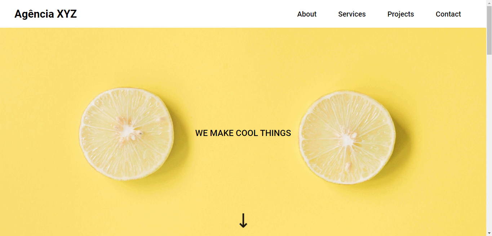

# 📕 Descrição
Projeto realizado com base nos módulos de HTML e CSS avançados do curso DevQuest, foi criado todas as seções linkadas de uma landing page usando Flexbox, Grid e Layout Responsivo

[Clique aqui para acessar](https://edu-almeidaf.github.io/landing-page-grid/)


# 🔧 Ferramentas Utilizadas
- HTML5
- CSS3


# 💡Lições aprendidas
```JavaScript
let licoesAprendidas = [
 'Flexbox',
 'Transitions',
 'Responsividade',
 'Animações',
 'Menu Hamburguer',
 'Grid' 
]